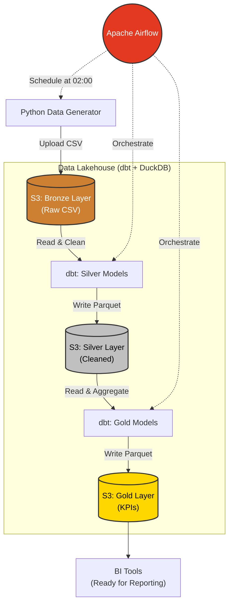
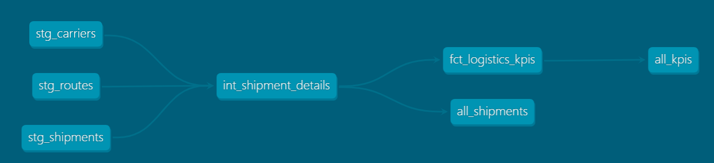

# Logistics ETL Pipeline

> Một hệ thống **Modern Data Lakehouse** toàn diện cho ngành vận tải (Logistics), được xây dựng để giải quyết bài toán theo dõi hiệu suất vận hành (SLA) và tối ưu hóa chi phí vận chuyển. Dự án ứng dụng mô hình **Medallion Architecture** chuẩn công nghiệp, kết hợp khả năng tự động hóa hạ tầng (**Terraform**), điều phối luồng dữ liệu (**Airflow**) và biến đổi dữ liệu hiện đại (**dbt + DuckDB**) trên môi trường Cloud giả lập.

## Kiến trúc



## Key Highlights / Skills

Dự án này ứng dụng các kỹ năng và tiêu chuẩn công nghiệp mới nhất của Data Engineering:
- **Medallion Architecture**: Tổ chức dữ liệu theo 3 phân lớp (Bronze, Silver, Gold) giúp dễ dàng quản lý chất lượng và vòng đời dữ liệu.
- **Incremental Loading**: Tối ưu hoá tài nguyên bằng cơ chế ghi đè partition theo ngày (`date=...`), không xử lý lại toàn bộ lịch sử.
- **Containerization (Docker)**: Đóng gói và triển khai đồng bộ môi trường bằng Docker Compose (Airflow, Postgres, S3 Emulator).
- **Infrastructure as Code (IaC)**: Quản lý hạ tầng ảo hoá (S3 buckets) hoàn toàn tự động thông qua Terraform.
- **Data Quality & Testing**: Tích hợp các bài test của dbt để đảm bảo tính toàn vẹn của dữ liệu trước khi lên Dashboard.

## Tech Stack

| Công cụ     | Vai trò                                                   |
|-------------|-----------------------------------------------------------|
| **Docker**  | Chạy Floci, Postgres, Airflow                             |
| **Floci**   | Giả lập AWS S3 (endpoint: `http://localhost:4566`)        |
| **Terraform** | Tạo S3 bucket `logistics-lake` với 3 layer prefix       |
| **Python + Faker** | Sinh dữ liệu logistics giả lập, upload lên S3     |
| **dbt + DuckDB** | Xử lý dữ liệu theo Medallion Architecture          |
| **Airflow** | Lập lịch pipeline chạy hàng ngày lúc 02:00 (GMT+7)       |

## Cấu trúc thư mục

```
logistics_project/
├── docker-compose.yml         # Floci + Postgres + Airflow
├── infrastructure/
│   └── main.tf                # Terraform: tạo S3 bucket
├── data_gen/
│   ├── main.py                # Script sinh dữ liệu + upload S3
│   └── requirements.txt
├── dbt_project/
│   ├── dbt_project.yml
│   ├── profiles.yml           # DuckDB + httpfs cấu hình S3
│   └── models/
│       ├── bronze/            # Views đọc CSV từ S3
│       │   ├── stg_shipments.sql
│       │   ├── stg_carriers.sql
│       │   └── stg_routes.sql
│       ├── silver/            # Enrich + Clean (External Parquet)
│       │   ├── int_shipment_details.sql   # Ghi partition theo ngày
│       │   └── all_shipments.sql          # View đọc toàn bộ Parquet
│       ├── gold/              # KPI Aggregation (External Parquet)
│       │   ├── fct_logistics_kpis.sql     # Ghi partition theo ngày
│       │   └── all_kpis.sql               # View đọc toàn bộ Parquet
│       └── schema.yml         # Data quality tests
└── airflow/
    └── dags/
        └── logistics_etl_dag.py   # Daily DAG
```

## Cài đặt Công cụ

### 1. Docker Compose
Đảm bảo đã cài **Docker Desktop** và bật **WSL Integration** (trong Settings -> Resources).

### 2. Terraform (cho WSL/Ubuntu)
```bash
sudo snap install terraform --classic
```

## Hướng dẫn chạy

### Bước 1 – Khởi động Docker (Floci + Airflow)
```bash
docker compose up -d
```
- Floci S3: `http://localhost:4566`
- Airflow UI: `http://localhost:8080` (user: `admin` / pass: `admin`)

### Bước 2 – Triển khai hạ tầng (Terraform)

Bạn có thể chọn một trong hai cách sau:

**Cách A: Dùng cho Development (Nhanh)**
```bash
cd infrastructure
terraform init
terraform apply -auto-approve
```

**Cách B: Quy trình chuẩn Production (An toàn)**
1. **Khởi tạo và kiểm tra:**
   ```bash
   terraform init
   terraform plan -out=main.tfplan
   ```
2. **Review:** Kiểm tra kỹ các thay đổi trong log terminal.
3. **Thực thi:**
   ```bash
   terraform apply "main.tfplan"
   ```

### Bước 3 – Test nạp dữ liệu thủ công (tuỳ chọn)
```bash
cd data_gen
pip install -r requirements.txt
python main.py --rows 2000 --date 2024-01-15
```

Kiểm tra file đã lên S3:
```bash
aws s3 ls s3://logistics-lake/bronze/shipments/ --endpoint-url=http://localhost:4566 --recursive
```

### Bước 4 – Kích hoạt DAG trên Airflow
1. Mở `http://localhost:8080`
2. Bật DAG `logistics_daily_etl`
3. Nhấn **Trigger DAG** để chạy thủ công, hoặc đợi lịch tự động lúc 02:00

### Bước 5 – Xem kết quả trong DuckDB
```bash
duckdb /opt/airflow/data/logistics.duckdb
```
```sql
-- KPI theo carrier (tất cả các ngày)
SELECT * FROM gold.all_kpis ORDER BY data_date DESC LIMIT 20;

-- Đơn hàng Silver layer (tất cả các ngày)
SELECT carrier_name, status, COUNT(*) AS cnt
FROM silver.all_shipments
GROUP BY 1, 2
ORDER BY 3 DESC;
```

## Data Model & Lineage Graph

Hệ thống sử dụng dbt để biến đổi dữ liệu một cách chặt chẽ. Dưới đây là luồng xử lý (Lineage Graph) từ dữ liệu thô (stg) đến bảng tổng hợp (fct):




## Dữ liệu giả lập

| Bảng           | Mô tả                                         |
|----------------|-----------------------------------------------|
| `carriers`     | 10 công ty vận chuyển (Viettel Post, GHN...) |
| `routes`       | 132 tuyến đường giữa 12 tỉnh thành            |
| `shipments`    | ~2,000 đơn/ngày, partition theo `date=`       |

## KPI Gold Layer

| Metric                 | Mô tả                                    |
|------------------------|------------------------------------------|
| `delivery_rate_pct`    | Tỷ lệ giao thành công (%)               |
| `on_time_rate_pct`     | Tỷ lệ giao đúng hạn (%)                 |
| `total_revenue`        | Tổng doanh thu phí vận chuyển (VND)      |
| `avg_transit_days`     | Thời gian vận chuyển trung bình (ngày)   |
| `avg_fee_per_km`       | Phí trung bình theo km                   |
| `cnt_electronics` ...  | Số đơn theo loại sản phẩm               |
